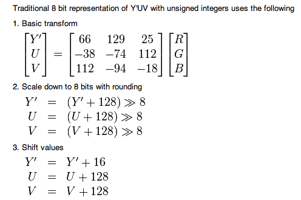
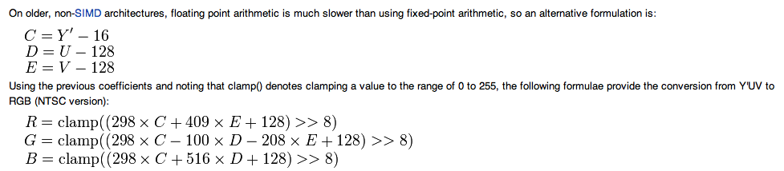

# 3D Graphics Rendering and Image Processing relevant Resource Collection
3D图形渲染及数字图像处理算法相关文集

<br />

- [彩阳的CSDN博客](http://blog.csdn.net/jiangcaiyang123/article/category/1246122)
- [侯思松博客](http://blog.csdn.net/housisong)
- [mg博客](https://www.cnblogs.com/minggoddess/)
- [handyTOOL的简书OpenGL ES文集](https://www.jianshu.com/nb/11846847)
- [梁老师的博客园](https://www.cnblogs.com/len3d/)
- [Morgan McGuire](https://research.nvidia.com/person/morgan-mcguire?tdsourcetag=s_pcqq_aiomsg)
- [Matt Oztalay](https://linktr.ee/epicmattoztalay)
- [What exactly is a softlock?](https://gaming.stackexchange.com/questions/357095/what-exactly-is-a-softlock)
- [https://learnopengl.com/](https://learnopengl.com/)
- [Advanced Graphics Programming Techniques](https://www.opengl.org/archives/resources/code/samples/sig99/advanced99/notes/notes.html)
- [GPU渲染管线之旅（GPU渲染管线中的硬件实现）](https://www.zhihu.com/column/c_1265245746099941376)
- [实时渲染管线:（三）逻辑管线](https://zhuanlan.zhihu.com/p/440593877)
- [Life of a triangle - NVIDIA's logical pipeline](https://developer.nvidia.com/content/life-triangle-nvidias-logical-pipeline)
- [OpenGL -- 屏幕成像和渲染原理解析](https://www.toutiao.com/article/7153963074285322791/)
- [图形学:名词解释](https://blog.csdn.net/hellotruth/article/details/40889701)
- [计算机图形学里面所说的 **片元** 是什么](https://zhidao.baidu.com/question/1367025072868259579.html)（**片元** 就是 **片段**，即：***fragment***）
- [片段与像素的区别](https://www.cnblogs.com/millionsmultiplication/p/10766778.html)
- [完美的视图旋转算法](https://www.cnblogs.com/len3d/p/5530401.html)
- [OpenGL缓冲区对象之UBO](https://blog.csdn.net/csxiaoshui/article/details/32101977)
- [Opengl入门系列- FBO的渲染到纹理的用法](https://blog.csdn.net/zangle260/article/details/40430929)
- [计算机图形学七：纹理映射\(Texture Mapping\)及Mipmap技术](https://zhuanlan.zhihu.com/p/144332091)
- [Texture Gathers and Coordinate Precision](https://www.reedbeta.com/blog/texture-gathers-and-coordinate-precision/)
- [非常详细易懂的法线贴图(Normal Mapping)](https://blog.csdn.net/qq_26900671/article/details/79048727)
- [3D 建模中的法线贴图解释](https://www.toutiao.com/article/7317458983211090468/)
- [凹凸映射（Bump Map）实现原理](https://blog.csdn.net/archielau/article/details/9124341)
- [Shadow Map Antialiasing](https://zhuanlan.zhihu.com/p/518149734)
- [各向异性（anisotropic）浅提](https://blog.csdn.net/YuYunTan/article/details/84348037)
- [Shader Anisotropic 各项异性](https://blog.csdn.net/baidu_16312167/article/details/75527961)
- [OpenGL.Shader：9-学习光照-法线贴图（计算TBN矩阵）](https://blog.csdn.net/a360940265a/article/details/94719015)
- [游戏画面设置中的“各向异性过滤”是做什么的？](https://www.zhihu.com/question/411035839)
- [图像处理基础（三）各向异性滤波](https://zhuanlan.zhihu.com/p/443182644)
- [OpenGL调试技巧汇总](https://blog.csdn.net/zjz520yy/article/details/83034140)
- [4.4抗锯齿概论](https://zhuanlan.zhihu.com/p/487990470)
- [FBO中多重采样抗锯齿（MSAA：MultiSampling Anti-Aliasing）](http://blog.csdn.net/pizi0475/article/details/7932915)
- [Multisampling primer](https://www.rastergrid.com/blog/gpu-tech/2021/10/multisampling-primer/)
- [WebGL2系列之多采样渲染缓冲对象](https://blog.csdn.net/netcy/article/details/95948811)
- [Another New Anti-Aliasing Mode: Enhanced Quality AA](https://www.anandtech.com/show/4061/amds-radeon-hd-6970-radeon-hd-6950/10)
- [抗锯齿taa和fxaa区别？](https://baijiahao.baidu.com/s?id=1770505625550467551)
- [What is the Morphological Anti-Aliasing \(MLAA\)](https://www.geeks3d.com/20101023/tips-what-is-the-morphological-anti-aliasing-mlaa/)
- [SMAA: Subpixel Morphological Antialiasing](https://github.com/iryoku/smaa)
- 上一帧的深度投影到当前帧：
```glsl
sample2D(depth_buffer_last, (pixel_coordinates * inverse(MPV_current) * MPV_last).xy )
```
如果是shadowmap，就用那个light space projection matrix。scatter的问题 bilateral filter 搞下。

- [双边滤波 - Bilateral Filter](https://zhuanlan.zhihu.com/p/180497579)
- [Tone Mapping](https://zhuanlan.zhihu.com/p/484407937)
- [图形 4.1 Bloom算法 游戏中的辉光效果实现](https://zhuanlan.zhihu.com/p/577616439)
- [An investigation of fast real-time GPU-based image blur algorithms](https://www.intel.com/content/www/us/en/developer/articles/technical/an-investigation-of-fast-real-time-gpu-based-image-blur-algorithms.html)
- [【论文复现】The Power of Box Filters](https://zhuanlan.zhihu.com/p/376909693)
- [高品质后处理：十种图像模糊算法的总结与实现](https://zhuanlan.zhihu.com/p/125744132)
- [颜色空间——Gamma与线性颜色空间](https://www.cnblogs.com/guanzz/p/7416821.html)
- [一文理解 YUV](https://zhuanlan.zhihu.com/p/75735751)
- [PVR/PVRTC解压源码](https://github.com/Volcore/quickpvr)
- [png转换成pvz源代码](https://github.com/cjhanson/PNGPOTimizer/tree/CCZ)
- [Optimizing Triangles for a Full-screen Pass](https://wallisc.github.io/rendering/2021/04/18/Fullscreen-Pass.html)（内含 **GPU Quads** 这一概念）
- [移动平台游戏的性能优化](http://www.csdn.net/article/2015-05-27/2824785)
- [Performance Tuning for Tile-Based Architecture Tile-Based架构下的性能调校](http://www.cnblogs.com/gameknife/p/3515714.html)
- [移动端下PLS（Pixel Local Storage）减少带宽开销的原理](https://blog.csdn.net/CrazyEngine/article/details/120310567)
- [数字图像处理 傅里叶变换](http://blog.csdn.net/zkp0601/article/details/41295283)
- [轻量级隐写分析模型](https://www.toutiao.com/i6895918997670363651/)
- [Shader resource view \(SRV\) and Unordered Access view \(UAV\)](https://learn.microsoft.com/en-us/windows/uwp/graphics-concepts/shader-resource-view--srv-)
- [D3D渲染技术之纹理](https://blog.csdn.net/jxw167/article/details/82824741)
- [Transforms \(Direct3D 9\)](https://learn.microsoft.com/en-us/windows/win32/direct3d9/transforms)
- [The Direct3D Transformation Pipeline](https://learn.microsoft.com/en-us/windows/win32/dxtecharts/the-direct3d-transformation-pipeline)
- [Direct3D Views](https://learn.microsoft.com/en-us/windows/uwp/graphics-concepts/views)

Direct3D 12 resources in HLSL are bound to virtual registers within logical register spaces:

- t – for shader resource views (SRV)
- s – for samplers
- u – for unordered access views (UAV)
- b – for constant buffer views (CBV)

在Direct3D的颜色表示中，**_SNORM** 后缀表示带符号的规格化的整数；它在一个资源中表示为一个带符号的整型数据，且在shader中被解释为一个带符号的范围在[-1, 1]的浮点值。对于以2的补码形式的整数来说，最大值为1.0f（一个5位的二进制数01111映射为1.0f），最小值是-1.0f（一个5位二进制数10000映射为-1.0f）。此外，第二小的数也被映射为-1.0f（一个5位的二进制数10001被映射为-1.0f）。整数结果的表示被均匀地分布在(-1.0 ... 0.0f) 浮点值范围内，且相对的其补集表示的数在 (0.0f ... 1.0f) 范围内。**_UNORM** 后缀表示无符号规格化整数；它在一个资源中被解释为一个无符号整数，且在shader中被解释为一个无符号的规格化的浮点数，范围在[0, 1]内。所有0被映射为0.0f，而所有的1被映射为1.0f。一个均匀分布的浮点值序列被表示为从0.0f到1.0f。例如，一个2比特的UNORM（00, 01, 10, 11）分别表示为：0.0f，1/3，2/3及1.0f。

在Vulkan中，**SSCALED** 后缀表示带符号的整数；它在主机端的资源中表示一个带符号的整数，且在shader中被解释为一个与主机端的值相对应的带符号的浮点数。**USCALED** 后缀表示无符号的整数；它在主机端的资源中表示一个无符号的整数，且在shader中被解释为一个与主机端的值相对应的无符号的浮点数。

详情可见：[VK_FORMAT_R8G8B8A8_[U/S]SCALED vs VK_FORMAT_A8B8G8R8_[U/S]SCALED_PACK32 ?](https://community.khronos.org/t/vk-format-r8g8b8a8-u-s-scaled-vs-vk-format-a8b8g8r8-u-s-scaled-pack32/6769)

- **Direct3D 10** 起所使用的颜色格式：[DXGI_FORMAT enumeration](https://learn.microsoft.com/en-us/windows/win32/api/dxgiformat/ne-dxgiformat-dxgi_format)
- 老旧的 **Direct3D 9** 所使用的颜色格式：[D3DFORMAT](https://learn.microsoft.com/en-us/windows/win32/direct3d9/d3dformat)
- Windows DDI 所支持的颜色格式：[D3DDDIFORMAT enumeration](https://learn.microsoft.com/en-us/windows-hardware/drivers/ddi/d3dukmdt/ne-d3dukmdt-_d3dddiformat)
- Vulkan 支持的颜色格式：[VkFormat](https://registry.khronos.org/vulkan/specs/1.3-extensions/man/html/VkFormat.html)
- OpenGL 颜色格式可参考：[Image Format](https://www.khronos.org/opengl/wiki/Image_Format) 以及 [Image formats](https://www.khronos.org/opengl/wiki/Layout_Qualifier_(GLSL)#Image_formats)
- [Tutorial 12 : OpenGL Extensions](http://www.opengl-tutorial.org/intermediate-tutorials/tutorial-12-opengl-extensions/)
- [OpenGL ES3使用MSAA（多重采样抗锯齿）的方法](https://www.cnblogs.com/zenny-chen/p/5058575.html)
- [DirectX 12小技巧-启用MSAA](https://zhuanlan.zhihu.com/p/460439298)
- [SimpleMSAA_PC12](https://github.com/microsoft/Xbox-ATG-Samples/tree/main/PCSamples/IntroGraphics/SimpleMSAA_PC12)
- [Vulkan spec 28.4. Multisampling](https://registry.khronos.org/vulkan/specs/1.3-extensions/html/vkspec.html#primsrast-multisampling)
- [Vulkan MSAA (Multisample anti-aliasing)](https://docs.vulkan.org/samples/latest/samples/performance/msaa/README.html)
- [Vulkan MSAA](https://zhuanlan.zhihu.com/p/661448130)
- [游戏引擎随笔 0x15：现代图形 API 的 MSAA](https://zhuanlan.zhihu.com/p/263101710)
- [GLSL Programming/GLUT/Transparency](https://en.wikibooks.org/wiki/GLSL_Programming/GLUT/Transparency)（这篇文章是关于颜色混合半透明效果讲解得比较透彻的。这里需要注意的是，由于 iOS 中的图形流水线机制是将从片段着色器输出的像素颜色值，在送到颜色混合固定功能单元之前就已经预先乘了 alpha 值。这种情况下需要使用 `glBlendFunc(GL_ONE, GL_ONE_MINUS_SRC_ALPHA)` 来做颜色混合。）
- [opengl es2 premultiplied vs straight alpha + blending](https://stackoverflow.com/questions/19674740/opengl-es2-premultiplied-vs-straight-alpha-blending)
- [Order-Independent Transparency](https://www.cnblogs.com/mavaL/p/3525890.html)
- [OpenGL ES 2.0+ 如何设置点的大小](https://gamedev.stackexchange.com/questions/11095/opengl-es-2-0-point-sprites-size)
- [PointSize\(3\) Manual Page](https://registry.khronos.org/vulkan/specs/1.3-extensions/man/html/PointSize.html)
- [Point Sprites \(Direct3D 9\)](https://learn.microsoft.com/en-us/windows/win32/direct3d9/point-sprites)
- [Point Sprites](http://www.informit.com/articles/article.aspx?p=770639&seqNum=7)
- [Chapter 7. Sprites and Text](https://www.oreilly.com/library/view/iphone-3d-programming/9781449388133/ch07.html)
- [OpenGL Interpolation Qualifiers (GLSL)](https://www.geeks3d.com/20130514/opengl-interpolation-qualifiers-glsl-tutorial/)
- [DX10/11/12、OpenGL4.0、Vulkan开启Flat shading着色模式](https://blog.csdn.net/qq_38327353/article/details/115709568)
- [Interpolation Modifiers Introduced in Shader Model 4](https://learn.microsoft.com/en-us/windows/win32/direct3dhlsl/dx-graphics-hlsl-struct)
- [Gouraud shading与Phong shading的区别（原理概念+shader代码）](https://zhuanlan.zhihu.com/p/411933220)
- [GLSL: Center or Centroid?  \(Or When Shaders Attack!\)](https://www.opengl.org/pipeline/article/vol003_6/)（其中介绍了使用 **`centroid`** 模式不会产生 **extrapolation**，而只会使用 **interpolation**；但 **`center`** 模式则可能会引发 **extrapolation**）
- [extrapolation and interpolation](https://www.techtarget.com/whatis/definition/extrapolation-and-interpolation)
- [Extrapolation wiki](https://en.wikipedia.org/wiki/Extrapolation)
- [Barycentric coordinate system](https://en.m.wikipedia.org/wiki/Barycentric_coordinate_system)
- [OpenGL 学习笔记之 VBO VAO EBO 概念和使用方法总结](https://www.cnblogs.com/im18620660608/p/17210544.html)
- [OpenGL ES之uniform和varying](https://zhuanlan.zhihu.com/p/103687720)
- [gluLookAt](https://www.khronos.org/registry/OpenGL-Refpages/gl2.1/xhtml/gluLookAt.xml)
- [GluLookAt code](https://www.khronos.org/opengl/wiki/GluLookAt_code)
- [D3D RHW的理解](https://blog.csdn.net/mengzhisuoliu/article/details/78937498)
- [从零开始的Vulkan](https://www.zhihu.com/column/c_1542671286655873024)
- [一起学Vulkan图形开发](https://www.zhihu.com/column/chenyong2vulkan)
- [Render graphs and Vulkan — a deep dive](http://themaister.net/blog/2017/08/15/render-graphs-and-vulkan-a-deep-dive/)
- [Vulkan Window System Integration \(WSI\)](https://github.com/KhronosGroup/Vulkan-Guide/blob/main/chapters/wsi.adoc)
- [Use `Direct-to-Display` Demo](https://github.com/search?q=repo%3ASaschaWillems%2FVulkan%20%20%20_DIRECT2DISPLAY&type=code)
- [OpenGL 坐标系统详解](https://zhuanlan.zhihu.com/p/665555142)
- [Vulkan坐标系](https://zhuanlan.zhihu.com/p/97496535)（NDC——Normalized Device Coordinates，标准化设备坐标）
- [Vulkan 右手坐标系见解](https://zhuanlan.zhihu.com/p/365830760)
- [Coordinate Systems \(Direct3D 9\)](https://learn.microsoft.com/en-us/windows/win32/direct3d9/coordinate-systems)
- [游戏引擎随笔 0x13：现代图形 API 的 Bindless](https://zhuanlan.zhihu.com/p/136449475)
- [Managing bindless descriptors in Vulkan](https://dev.to/gasim/implementing-bindless-design-in-vulkan-34no)
- [Vulkan Dynamic State](https://zhuanlan.zhihu.com/p/338237434)
- [How to use a vulkan sampler with unnormalized texture-coordinates?](https://stackoverflow.com/questions/65790303/how-to-use-a-vulkan-sampler-with-unnormalized-texture-coordinates-without-trig)
- [Vulkan查询支持哪些图像形式的VkFormat——vkGetPhysicalDeviceFormatProperties](https://registry.khronos.org/vulkan/specs/1.3-extensions/man/html/vkGetPhysicalDeviceFormatProperties.html)
- [Vulkan查询支持哪些纹理采样格式的VkFormat——vkGetPhysicalDeviceImageFormatProperties](https://registry.khronos.org/vulkan/specs/1.3-extensions/man/html/vkGetPhysicalDeviceImageFormatProperties.html)
- [Vulkan中的同步与缓存控制](https://zhuanlan.zhihu.com/p/161619652)
- [Vulkan 同步机制 Fence Semaphore](https://zhuanlan.zhihu.com/p/380719229)
- [\[译\]Vulkan教程(23)暂存buffer](https://www.cnblogs.com/bitzhuwei/p/Vulkan-Tutoria-23-Staging-buffer.html)
- [How to use Vulkan Timestamp Queries.](https://nikitablack.github.io/post/how_to_use_vulkan_timestamp_queries/)
- [Vulkan Mobile Best Practices - Management of Command Buffers and Multi-Threaded Recording](https://community.arm.com/arm-community-blogs/b/graphics-gaming-and-vr-blog/posts/vulkan-mobile-best-practices-and-management)
- [从Vulkan API看Shader的数据绑定机制](https://zhuanlan.zhihu.com/p/111882744)
- [Vulkan推荐用法(三星设备)](https://zhuanlan.zhihu.com/p/97321638)
- [vulkan_延迟渲染](https://blog.csdn.net/qq_35312463/article/details/105878760)
- [从零开始的Vulkan（附一）：多Subpass实现延迟渲染](https://zhuanlan.zhihu.com/p/558644452)
- [A simple Vulkan Compute example](http://www.duskborn.com/posts/a-simple-vulkan-compute-example/)
- [\[vulkan\] compute shader](https://zhuanlan.zhihu.com/p/56106712)
- [User defined WorkGroup sizes in Vulkan Compute shaders](https://community.khronos.org/t/user-defined-workgroup-sizes-in-vulkan-compute-shaders/7082)
- [Compute Shaders in D3D12](https://logins.github.io/graphics/2020/10/31/D3D12ComputeShaders.html)
- [使用计算着色器（Compute Shader）模拟粒子效果【OpenGL】](https://blog.csdn.net/panda1234lee/article/details/70521910)
- [OpenGL ES3.1使用计算着色器（Compute Shader）](https://blog.csdn.net/qq_39561000/article/details/103112147)
- [同步连续的OpenGL Compute Shader调用](https://qastack.cn/computergraphics/400/synchronizing-successive-opengl-compute-shader-invocations)
- [Direct3D 11 Geometry Shader Stage](https://learn.microsoft.com/en-us/windows/win32/direct3d11/geometry-shader-stage)
- [几何着色器（Geometry Shader）的基础介绍以及简单示例](https://zhuanlan.zhihu.com/p/585436751)
- [OpenGL Geometry Shader](https://www.khronos.org/opengl/wiki/Geometry_Shader)
- [Would love to see optional Geometry Shaders](https://github.com/gpuweb/gpuweb/issues/1239)
- [几何着色器](https://learnopengl-cn.github.io/04%20Advanced%20OpenGL/09%20Geometry%20Shader/)
- [【OpenGL】笔记二十七、几何着色器](https://blog.csdn.net/ycrsw/article/details/125128835)
- [OpenGL之几何着色器(Geometry Shader)详解](https://blog.csdn.net/What_can_you_do/article/details/128255831)
- [Geometry Blending \(Direct3D 9\)](https://learn.microsoft.com/en-us/windows/win32/direct3d9/geometry-blending)
- [Vertex Blending under DirectX 7 for the GeForce 256](https://developer.download.nvidia.com/assets/gamedev/docs/Vertex_blending.pdf)
- [Core Language (GLSL)](https://www.khronos.org/opengl/wiki/Core_Language_(GLSL))
- [GLSL \#include](https://www.gamedev.net/forums/topic/316061-glsl-include/)
- [浅谈OpenGL之DSA](https://www.cnblogs.com/hellobb/p/13943969.html)
- OpenGL保存当前状态：[glPushAttrib function](https://learn.microsoft.com/en-us/windows/win32/opengl/glpushattrib)
- [OpenGL三维纹理坐标](http://blog.sina.com.cn/s/blog_687960370101gyh8.html)
- [OpenGL版本低于4.5的glBindTextureUnit的替代品?](http://ask.sov5.cn/q/xaqaFk3Esa)
- [OpenGL之——多纹理，混合纹理设置渲染](https://blog.csdn.net/qq_35294564/article/details/86546797)
- [Issue with RGBA32F texture format and mipmapping using OpenGL ES 3.0](https://stackoverflow.com/questions/44754479/issue-with-rgba32f-texture-format-and-mipmapping-using-opengl-es-3-0)
- [Render to half float texture](https://stackoverflow.com/questions/23253497/render-to-half-float-texture)
- [Read texture data](https://riptutorial.com/opengl/example/23514/read-texture-data)（OpenGL使用：**`glGetTexImage`**）
- 利用GLU工具库对任意原始图像数据进行缩放：[gluScaleImage function](https://learn.microsoft.com/en-us/windows/win32/opengl/gluscaleimage)
- [Learning DirectX 12 – Lesson 4 – Textures](https://www.3dgep.com/learning-directx-12-4/)
- [DirectXTK12/RenderTexture -- This provides a helper class for managing an offscreen render target.](https://github.com/microsoft/DirectXTK12/wiki/RenderTexture)
- [Data Type \(GLSL\)](https://www.khronos.org/opengl/wiki/Data_Type_\(GLSL\))（其中包含了结构体类型 **`struct`**）
- GLSL中，结构体必须至少含有一个成员声明。成员声明符可以包含精度限定符，但不能使用其他限定符，否则会导致编译时错误。GLSL中的结构体不支持位域（**bit fields**）。成员的类型必须是已经定义过的（不允许存在不完整类型）。如果成员声明包含了一个初始化器，那么会产生编译时错误。如果成员是一个数组，那么它必须具有一个指定的非零大小，且用于指定该大小的表达式必须是一个 **整数常量表达式**（[Constant Expressions](https://registry.khronos.org/OpenGL/specs/gl/GLSLangSpec.4.60.html#constant-expressions)）。
- [Interface Block \(GLSL\)](https://www.khronos.org/opengl/wiki/Interface_Block_\(GLSL\))
- [Atomic Counter](https://www.khronos.org/opengl/wiki/Atomic_Counter)
- [OpenGL 4.2 Atomic Counter Demo: Rendering Order of Fragments](https://www.geeks3d.com/20120309/opengl-4-2-atomic-counter-demo-rendering-order-of-fragments/)
- [OpenGL GLSL atomic counter in Vulkan](https://stackoverflow.com/questions/56682438/opengl-glsl-atomic-counter-in-vulkan)
- [Vertex Rendering](https://www.khronos.org/opengl/wiki/Vertex_Rendering)
- [Primitive](https://www.khronos.org/opengl/wiki/Primitive)
- [Shader Basics - Fragment Shader](https://shader-tutorial.dev/basics/fragment-shader/)
- [Rasterization Rules](https://learn.microsoft.com/en-us/windows/win32/direct3d11/d3d10-graphics-programming-guide-rasterizer-stage-rules)
- [Rasterization: a Practical Implementation](https://www.scratchapixel.com/lessons/3d-basic-rendering/rasterization-practical-implementation/perspective-correct-interpolation-vertex-attributes.html)
- [Direct3D 11 -- Configuring Depth-Stencil Functionality](https://learn.microsoft.com/en-us/windows/win32/direct3d11/d3d10-graphics-programming-guide-depth-stencil)
- [深度测试（Depth Test）概念](https://zhuanlan.zhihu.com/p/593562090)
- [Issue with reading depth buffer after depth render pass](https://community.khronos.org/t/issue-with-reading-depth-buffer-after-depth-render-pass/107442)
- [How updating a depth buffer works in GPU?](https://computergraphics.stackexchange.com/questions/1954/how-updating-a-depth-buffer-works-in-gpu)
- [Early Fragment Test](https://www.khronos.org/opengl/wiki/Early_Fragment_Test)（HLSL中使用：[earlydepthstencil](https://learn.microsoft.com/en-us/windows/win32/direct3dhlsl/sm5-attributes-earlydepthstencil)）
- [Rectangle Texture](https://www.khronos.org/opengl/wiki/Rectangle_Texture)
- [Buffer Texture](https://www.khronos.org/opengl/wiki/Buffer_Texture)
- [samplerBuffer example needed](https://community.khronos.org/t/samplerbuffer-example-needed/63904)
- [OpenGL Image Load Store Wiki](https://www.khronos.org/opengl/wiki/Image_Load_Store)
- [Image Format](https://www.khronos.org/opengl/wiki/Image_Format)
- [OpenGL 图像的加载和存储](https://blog.csdn.net/dayenglish/article/details/51439296)
- [OpenGL-Atomic Operations on Images（一）](https://zhuanlan.zhihu.com/p/84191004)
- [OpenGL图像\(image\)](https://blog.csdn.net/qq_16555407/article/details/84307374)
- [difference between glTextureBarrier\(\) and glMemoryBarrier\(GL_TEXTURE_FETCH_BARRIER_BIT\)](https://stackoverflow.com/questions/37448712/difference-between-gltexturebarrier-and-glmemorybarriergl-texture-fetch-barri)
- Khronos OpenGL官方文档中关于描述的 **`gbufferImage`** 类型，实际所对应的类型为：**`imageBuffer`**、**`iimageBuffer`** 和 **`uimageBuffer`**。该类型对应于Vulkan中具有 **`VK_BUFFER_USAGE_STORAGE_TEXEL_BUFFER_BIT`** usage 的 **`VkBuffer`**。同时在使用此 buffer 时需要结合 **`VkBufferView`** 一起使用。
- [Trouble with imageStore\(\) \(OpenGL 4.3\)](https://stackoverflow.com/questions/14285849/trouble-with-imagestore-opengl-4-3) （In desktop OpenGL, it is perfectly legal to upload floating-point data to a normalized integer texture; OpenGL is expected to convert the data as best it can. ES doesn't do conversions, so it has to change the internal format (the third parameter) to match the data.）
- [Can't access fbo attached texture in GLSL compute shader with gimage2D](https://stackoverflow.com/questions/22947896/cant-access-fbo-attached-texture-in-glsl-compute-shader-with-gimage2d)
- [Vulkan input attachments and sub passes](https://www.saschawillems.de/blog/2018/07/19/vulkan-input-attachments-and-sub-passes/)
- [Input Attachments - reading random location? Read/Write in same pass?](https://community.khronos.org/t/input-attachments-reading-random-location-read-write-in-same-pass/7035)
- [Precise Qualifier in GLSL and NVIDIA GeForce Cards](https://www.geeks3d.com/20120106/precise-qualifier-in-glsl-and-nvidia-geforce-cards/)
- [How exactly is GLSL's "coherent" memory qualifier interpreted by GPU drivers for multi-pass rendering?](https://stackoverflow.com/questions/9731204/how-exactly-is-glsls-coherent-memory-qualifier-interpreted-by-gpu-drivers-for)
- [GLSL: about coherent qualifier](https://stackoverflow.com/questions/56340333/glsl-about-coherent-qualifier)（内含 **`atomicAdd`** 的使用）
- [Primitive Restart and OpenGL Interoperability](https://www.codeproject.com/articles/201263/part-6-primitive-restart-and-opengl-interoperabili)
- [OpenGL ES 3.0: 图元重启\(Primitive restart\)](https://www.cnblogs.com/psklf/p/5750783.html)
- [OpenGL 图元重启](https://blog.csdn.net/yulinxx/article/details/77896541)
- [Direct3D 12 Conservative Rasterization](https://learn.microsoft.com/en-us/windows/win32/direct3d12/conservative-rasterization)
- [DirectX-Specs -- Conservative Rasterization](https://microsoft.github.io/DirectX-Specs/d3d/ConservativeRasterization.html)
- [Variable Rate Shading](https://microsoft.github.io/DirectX-Specs/d3d/VariableRateShading.html)
- [Variable-rate shading \(VRS\)](https://learn.microsoft.com/en-us/windows/win32/direct3d12/vrs)
- [VRS （Variable-rate shading） 技术介绍&移动端接入现状调研](https://zhuanlan.zhihu.com/p/628429688)
- [Fragment Shading Rate](https://docs.vulkan.org/samples/latest/samples/extensions/fragment_shading_rate_dynamic/README.html)
- [Sample Mask Overview](https://learn.microsoft.com/en-us/windows/win32/direct3d11/d3d10-graphics-programming-guide-output-merger-stage#sample-mask-overview) refers to [`D3D12_GRAPHICS_PIPELINE_STATE_DESC::SampleMask`](https://learn.microsoft.com/en-us/windows/win32/api/d3d12/ns-d3d12-d3d12_graphics_pipeline_state_desc#members)
- [29.4. Sample Mask Test](https://registry.khronos.org/vulkan/specs/1.3-extensions/html/vkspec.html#fragops-samplemask)
- [gl_SampleMask](https://registry.khronos.org/OpenGL-Refpages/gl4/html/gl_SampleMask.xhtml)（HLSL **`SV_Coverage`**）
- [Direct3D 11.3 Functional Specification -- 16.5 Pull Model Attribute Evaluation](https://microsoft.github.io/DirectX-Specs/d3d/archive/D3D11_3_FunctionalSpec.htm#16.5%20Pull%20Model%20Attribute%20Evaluation)
- [EvaluateAttributeSnapped function](https://learn.microsoft.com/en-us/windows/win32/direct3dhlsl/evaluateattributesnapped)
- [EvaluateAttributeSnapped function](https://github.com/MicrosoftDocs/win32/blob/docs/desktop-src/direct3dhlsl/evaluateattributesnapped.md)
- [Target Independent Rasterization](https://microsoft.github.io/DirectX-Specs/d3d/archive/D3D11_3_FunctionalSpec.htm#TIR)
- [GL_EXT_raster_multisample](https://registry.khronos.org/OpenGL/extensions/EXT/EXT_raster_multisample.txt)
- [VK_EXT_multisampled_render_to_single_sampled](https://registry.khronos.org/vulkan/specs/1.3-extensions/man/html/VK_EXT_multisampled_render_to_single_sampled.html)
- [DirectX-Specs D3D12 Depth Bounds Test](https://microsoft.github.io/DirectX-Specs/d3d/DepthBoundsTest.html)
- [Vulkan 29.8. Depth Bounds Test](https://registry.khronos.org/vulkan/specs/1.3-extensions/html/vkspec.html#fragops-dbt)
- [GL_EXT_depth_bounds_test](https://registry.khronos.org/OpenGL/extensions/EXT/EXT_depth_bounds_test.txt)
- [Direct3D 12 -- Memory Aliasing and Data Inheritance](https://learn.microsoft.com/en-us/windows/win32/direct3d12/memory-aliasing-and-data-inheritance)
- [Vulkan -- 12.8. Memory Aliasing](https://registry.khronos.org/vulkan/specs/1.3/html/chap12.html#resources-memory-aliasing)
- [Direct3D 11 Tiled resources](https://learn.microsoft.com/en-us/windows/win32/direct3d11/tiled-resources)
- [Volume tiled resources \(Direct3D 12\)](https://learn.microsoft.com/en-us/windows/win32/direct3d12/volume-tiled-resources)
- [DirectX-Specs -- Sampler Feedback](https://microsoft.github.io/DirectX-Specs/d3d/SamplerFeedback.html)
- [Vulkan 1.3 -- 33. Sparse Resources](https://registry.khronos.org/vulkan/specs/1.3-extensions/html/chap33.html)
- [Vulkan Spec -- Sparse Resources](https://docs.vulkan.org/spec/latest/chapters/sparsemem.html)
- [Vulkan Guide -- Sparse Resources](https://docs.vulkan.org/guide/latest/sparse_resources.html)
- [RWBuffer vs RWStructuredBuffer or RWByteAddressBuffer](https://gamedev.net/forums/topic/678018-rwbuffer-vs-rwstructuredbuffer-or-rwbyteaddressbuffer/)
- [D3D12 WriteBufferImmediate Hardware Spec](https://microsoft.github.io/DirectX-Specs/d3d/D3D12WriteBufferImmediate.html)
- [Framebuffer Object](https://www.khronos.org/opengl/wiki/Framebuffer_Object)
- [Framebuffer Fetch in Vulkan](https://community.arm.com/arm-community-blogs/b/graphics-gaming-and-vr-blog/posts/framebuffer-fetch-in-vulkan)（包含了对 **`subpassLoad`** 的使用）
- [Using SPIR-V in practice with SPIRV-Cross](https://www.khronos.org/assets/uploads/developers/library/2016-vulkan-devday-uk/4-Using-spir-v-with-spirv-cross.pdf)（包含关于 **Subpass Input Attachments** 的介绍）
- [shaders: semantics of "**`discard`**"](https://github.com/gpuweb/gpuweb/issues/361)
- [OpenGL Dual Source Blending](https://www.khronos.org/opengl/wiki/Blending#Dual_Source_Blending)
- [OpenGL ES MRT多目标渲染](https://www.jianshu.com/p/5daa834b7bda)
- > With multiple RTs, the pixel shader is called once per pixel and produces values for all render targets.
- [HOW TO RENDER TO A TEXTURE ARRAY IN UNITY](http://xdpixel.com/how-to-render-to-a-texture-array-in-unity/)
- [使用Warp/Wave与LDS优化Wavefront管线](https://zhuanlan.zhihu.com/p/648728304)
- [游戏引擎随笔 0x28：现代图形 API 的 Wave Intrinsics、Subgroup 以及 SIMD-group](https://zhuanlan.zhihu.com/p/469436345)
- [2D变3D，视角随意换，神还原高清立体感，还是不用3D建模的那种 | 代码数据开源](https://mp.weixin.qq.com/s/zz3WQvnwoGLg58SCRn7YjA)
- [android framebuffer和HAL以及显示系统](https://blog.csdn.net/wanglongwang201209/article/details/12616197)
- [Android下Opengl ES实现单屏幕双眼显示](https://blog.csdn.net/u011371324/article/details/68946779)
- [Bit blit](https://en.wikipedia.org/wiki/Bit_blit)
- 使用 [**`glProvokingVertex`**](https://registry.khronos.org/OpenGL-Refpages/gl4/html/glProvokingVertex.xhtml) 修改哪个顶点作为当前图元的 provoking vertex。
- [Face Culling](https://www.khronos.org/opengl/wiki/Face_Culling)
- [Vertex Post-Processing](https://www.khronos.org/opengl/wiki/Vertex_Post-Processing)
- [Clipping FAQ](https://www.khronos.org/opengl/wiki/Clipping_FAQ)
- [Clipping \(OpenGL\)](https://learn.microsoft.com/en-us/windows/win32/opengl/clipping)
- [初探FOV](https://zhuanlan.zhihu.com/p/312194696)
- [摄像头参数介绍 — 视场角\(FOV\)](https://blog.csdn.net/qq_42957717/article/details/125508235)
- [延迟着色法](https://learnopengl-cn.readthedocs.io/zh/latest/05%20Advanced%20Lighting/08%20Deferred%20Shading/)（对 **G-buffer** 有详细介绍）
- [Unity上怎么在移动端使用Render pass实现高性能的延迟着色？](https://www.zhihu.com/question/485735429)
- [延迟着色和Forward+在移动端各有什么利弊？](https://www.zhihu.com/question/487242931)
- [Deferred shading](https://en.wikipedia.org/wiki/Deferred_shading)（含有对 **G-buffer** 的引用）
- [Deferred shading on mobile: An API overview](https://community.arm.com/arm-community-blogs/b/graphics-gaming-and-vr-blog/posts/deferred-shading-on-mobile)
- [Vulkan Multipass Mobile Deferred Done Right](https://www.khronos.org/assets/uploads/developers/library/2017-gdc/GDC_Vulkan-on-Mobile_Vulkan-Multipass-ARM_Mar17.pdf)（包含了对 **`subpassLoad`** 的使用）
- [Vulkano Tutorial Multi-pass Rendering](https://taidaesal.github.io/vulkano_tutorial/section_7.html)（包含了对 **`subpassLoad`** 的使用）
- [\[主程必看\]移动设备GPU架构知识汇总！](https://m.sohu.com/a/408708498_667928)
- [[游戏中的图形学实时渲染技术] Part1 实时阴影技术](https://zhuanlan.zhihu.com/p/640873640)
- [一种软阴影的实现方法](https://blog.csdn.net/kenkao/article/details/6717247)
- [软阴影的实现尝试](https://zhuanlan.zhihu.com/p/158646632)
- [Unity——Screenspace Shadow Map与传统Shadow Map](https://blog.csdn.net/m0_62316271/article/details/128519219)
- [（官方转载）UE5 虚拟阴影贴图 （VirtualShadowMaps）的优势和局限性](https://zhuanlan.zhihu.com/p/407945117)
- [阴影贴图Variance Shadow Map](https://zhuanlan.zhihu.com/p/414746542)
- [PCSS（Percentage Closer Soft Shadows）](https://developer.huawei.com/consumer/cn/doc/graphics-Guides/pcss-0000001225365851)
- [【Unity Shader】自定义阴影ShadowMap(CSM)](https://zhuanlan.zhihu.com/p/394233602)
- [What are the key differences between Open Shader Language and GLSL](https://stackoverflow.com/questions/46093694/what-are-the-key-differences-between-open-shader-language-and-glsl)
- [Arm Frame Buffer Compression (AFBC)](https://developer.arm.com/architectures/media-architectures/afbc)
- [虚幻五渲染编程（Graphic篇）【第十六卷：Sparse Volume Texture 上】](https://zhuanlan.zhihu.com/p/671348210)
- [【UE】风格化场景全流程学习记录 Part1.地形（对RVT和材质的理解）](https://zhuanlan.zhihu.com/p/515603213)
- [计算机视觉的计算几何及Python实现](https://www.toutiao.com/a6637430623361303053)
- [polygon-mesh-in-computer-graphics](https://www.geeksforgeeks.org/polygon-mesh-in-computer-graphics/)
> A mesh is a collection of vertices, edges, and faces that define a 3D object's shape and geometry, it's used to represent 3D objects in computer graphics programs; it provides a way to define the object's surface in terms of vertices, edges, and faces.
```javascript
var geometry = new THREE.BoxGeometry(1, 1, 1),
var material = new THREE.MeshBasicMaterial({color: 0x00ff00}),
var cube = new THREE.Mesh(geometry, material),
scene.add(cube)
```
- [Computer Graphics Surfaces](https://www.tutorialspoint.com/computer_graphics/computer_graphics_surfaces.htm)
- [obj文件格式](https://zhuanlan.zhihu.com/p/552909558)
- [流形 & 非流形 释义](https://blog.csdn.net/weixin_30672019/article/details/101393043)
- [【翻译】哪些是流形，哪些不是流形](https://zhuanlan.zhihu.com/p/259312398)
- [Shapr3D 是否能创建流形几何？非流形几何？](https://zhuanlan.zhihu.com/p/383617844)
- [经过数十年的长期搜索，发现了超乎想象的曲面](https://www.163.com/dy/article/H987B5I20511831M.html)（这里提到了“亏格”【**genus**】）
- [16.4 三角形扇形(Fans)、条形(Strips)和网格](https://zhuanlan.zhihu.com/p/402709877)（`连接到一个顶点的边的数目称为顶点的价(valence)`）
- [Boundary Edge](https://www.sciencedirect.com/topics/engineering/boundary-edge)
- [Geodesic Distance（测地距离）](https://blog.csdn.net/Will_Ch/article/details/111185619)
- [网格边的种类](https://blog.csdn.net/dsfsdffgfd/article/details/122884409)
- [15.2 渲染轮廓](https://zhuanlan.zhihu.com/p/398383275)
- [球谐的基本理解](https://ttcn7kj9oq.feishu.cn/docx/IOWzdCNPDo0xYZxFjmDcygPenPf)
- [3D Gaussian Splatting简明教程](https://zhuanlan.zhihu.com/p/665135145)
- [计算机图形学-AABB碰撞检测算法](https://blog.csdn.net/qq_43369406/article/details/123683999)
- [Picking with custom Ray-OBB function](http://www.opengl-tutorial.org/miscellaneous/clicking-on-objects/picking-with-custom-ray-obb-function/)
- [一步一步实现基于GPU的pathtracer（一）：基础](https://www.cnblogs.com/time-flow1024/p/6943508.html)
- [一步一步实现基于GPU的pathtracer（二）：求交算法](https://www.cnblogs.com/time-flow1024/p/6944203.html)
- [一步一步实现基于GPU的pathtracer（三）：path tracing 简述](https://www.cnblogs.com/time-flow1024/p/9974702.html)
- [Path Tracing](https://www.jianshu.com/p/428317cd522a)
- [对pathtracing的一些个人理解](https://www.cnblogs.com/time-flow1024/p/6844208.html)
- [什么是路径追踪？](https://www.toutiao.com/article/7121909050081542688/)
- [一张图搞定SDF的概念](https://blog.csdn.net/pizi0475/article/details/49489605/)
- [2D平面基本图形SDF推导01](https://zhuanlan.zhihu.com/p/420700051)
- [光线追踪—层次包围盒（ Bounding Volume Hierarchies ）](https://blog.csdn.net/sunshine543123/article/details/107041122)
- [图解光线追踪进阶（二）BVH（The Next Week）](https://zhuanlan.zhihu.com/p/515981187)
- [BVH层级包围体原理及实现](https://zhuanlan.zhihu.com/p/644966940)
- [如果想在GPU里软件方式计算射线和场景加速求交，SDF和BVH哪个好，各有什么优缺点？](https://www.zhihu.com/question/476683981)
- [更快更清晰！NVIDIA首次实现SDF实时渲染，速度提升3个数量级](https://www.toutiao.com/i6924108185934660110/)
- [实时渲染器开发(四) GTAO原理与实践](https://zhuanlan.zhihu.com/p/342210503)
- [UE4 Real-time Hair Advances](https://www.fxguide.com/fxfeatured/ue4-real-time-hair-advances/)
- [UE5 Lumen原理介绍](https://zhuanlan.zhihu.com/p/380720641)
- [UE5渲染管线--Lumen全局光照](https://zhuanlan.zhihu.com/p/621956070)
- [UE5 Lumen实时全局光照系统简单分析](https://blog.csdn.net/qq_43459138/article/details/129275140)
- [UE5 Nanite原理介绍](https://zhuanlan.zhihu.com/p/393930818)
- [UE5渲染技术简介：Nanite篇](https://zhuanlan.zhihu.com/p/382687738)
- [Unreal Engine 5 Beginner Tutorial - UE5 Starter Course](https://www.youtube.com/watch?v=k-zMkzmduqI)
- [虚幻引擎神经网络引擎（NNE）](https://mp.weixin.qq.com/s?__biz=MzAxNzMzODkyMA==&mid=2650673645&idx=1&sn=522488cdcdeebc32ec82f5b0d241c38f)
- [动画电影LookDev流程科普](https://zhuanlan.zhihu.com/p/407833635)
- [Introducing Learned Motion Matching](https://montreal.ubisoft.com/en/introducing-learned-motion-matching/)
- [Learned Motion Matching](https://zhuanlan.zhihu.com/p/266755281)
- [Reflection Probe](https://www.jianshu.com/p/585dd805c137)
- [图形引擎实战：HDRP移动版高清渲染管线改造](https://zhuanlan.zhihu.com/p/567981404)
- [1.HDRP入门](https://zhuanlan.zhihu.com/p/458453634)
- [FSR、DLSS谁更靠谱？RX 7900 XT VS. RTX 4080对比测试](https://mp.weixin.qq.com/s?__biz=MzU2MTU4MTc1Ng==&mid=2247800701&idx=2&sn=5b691923555fe8c742fb7de6f1cab186)
- [画质提升显著！AMD FSR2.0技术解析和游戏实测](https://zhuanlan.zhihu.com/p/515270792)
- [AMD FSR 3 Now Available](https://community.amd.com/t5/gaming/amd-fsr-3-now-available/ba-p/634265)
- [AMD FidelityFX™ Super Resolution 3 \(FSR 3\)](https://gpuopen.com/fidelityfx-super-resolution-3/)
- [GDC | 在移动端实现144帧渲染：《暗区突围》手游中的帧预测](https://mp.weixin.qq.com/s?__biz=MzI3MTQzOTY3OQ==&mid=2247537256&idx=1&sn=267d47a80ff3826dc03f769609be8c4f)
- [SPH 3D流体模拟及其卡通化渲染](https://zhuanlan.zhihu.com/p/95102715)
- [OpenGL HDR](https://learnopengl.com/Advanced-Lighting/HDR)
- [Phong 光照模型（镜面反射）](https://www.cnblogs.com/jqm304775992/p/4890634.html)
- [Mipmapping with Bidirectional Techniques](https://blog.yiningkarlli.com/2018/10/bidirectional-mipmap.html)
- [Bidirectional reflectance distribution function](https://en.wikipedia.org/wiki/Bidirectional_reflectance_distribution_function)
- [BRDF Importance Sampling for Polygonal Lights](https://momentsingraphics.de/Siggraph2021.html)
- [Nested Dielectrics](https://blog.yiningkarlli.com/2019/05/nested-dielectrics.html)
- [这是我们要的未来 英伟达RTX光线追踪技术解析](https://www.toutiao.com/i6768787614779572743/)
- [Ray Tracing In Vulkan（Vulkan中的光线追踪）](https://zhuanlan.zhihu.com/p/114920256)
- [DirectX Raytracing（DXR） functional Spec阅读笔记+注解](https://zhuanlan.zhihu.com/p/34894883)
- [RTX Direct Illumination (RTXDI)](https://developer.nvidia.com/rtx/ray-tracing/rtxdi)
- [Deep Rendering](https://studios.disneyresearch.com/deep-rendering/)
- [张心欣破Nanite招数于此](https://zhuanlan.zhihu.com/p/140943267)
- [CG技术的转折点，算法TD的觉醒路](https://mp.weixin.qq.com/s?__biz=MzU2MTU4MTc1Ng==&mid=2247617154&idx=2&sn=7aad0ddbc6aa74752ee3b04cc36d1b42)
- [计算机图形学（CG技术）在日本动画制作中的应用](https://www.toutiao.com/article/7230626039855252023/)
- [GPU-Motunui](https://www.render-blog.com/)
- [OpenSubDiv](http://graphics.pixar.com/opensubdiv/docs/intro.html)
- [开源库 OpenVDB获得过奥斯卡奖的开源 C++ 库加入ASWF](https://www.cgspread.com/9867.html)（VDB即：**Volumetric Database**）
- [Arnold Documentation](https://www.arnoldrenderer.com/arnold/documentation/)
- [\[Arnold\] Standins and the ASS file cache](https://docs.arnoldrenderer.com/plugins/servlet/mobile#content/view/19205227)
- [Arnold(C4DToA)阿诺德渲染教程(111)：Arnold体系架构、设计理念、指导思想、技术内幕等 来自Solid Angle开发团队 最新的文献指南](https://www.btbat.com/10349.html/comment-page-11)
- [Maya Release GPU memory for unused textures](https://knowledge.autodesk.com/support/maya/learn-explore/caas/CloudHelp/cloudhelp/2016/ENU/Maya/files/GUID-74599EBE-1DC5-4ECE-86C0-A0216ABE0794-htm.html)
- [maya文件路径变量环境变量](https://blog.csdn.net/tian0000hai/article/details/90608132)
- [数字图像处理查找表LUT的介绍](https://blog.csdn.net/weixin_39527768/article/details/111221982)
- [OLED demura技术学习part1](https://blog.csdn.net/longmal/article/details/103850243)
- [OLED demura技术学习part2](https://blog.csdn.net/longmal/article/details/103850408)
- [AMOLED の 画质神器【Demura】](https://baijiahao.baidu.com/s?id=1700291087993044948)
- [线性蒙皮分解(SSDR)](https://zhuanlan.zhihu.com/p/384760680)
- [Vellum Cloth shelf tool](https://www.sidefx.com/docs/houdini/shelf/vellumcloth.html)
- [VELLUM CLOTH: TIPS & TRICKS](https://www.sidefx.com/tutorials/vellum-cloth-tips-tricks/)
- [nCloth](http://mottosso.com/ncloth-reference/)
- [Understanding and Creating nCloth Simulations in Maya](http://mottosso.com/ncloth-reference/)
- [MARVELOUS DESIGNER —— 更好、更快、更简单地制作3D服装！](https://marvelousdesigner.com/)
- [clo3d —— 虚拟服装 改变世界](https://www.clo3d.com/zh/)
- [Easing functions](https://easings.net/)
- [游戏基础知识——游戏中HUD与图标设计的规律](https://www.sohu.com/a/317362046_667840)
- [【卡通渲染】《原神》利用SDF图的面部阴影效果](https://www.bilibili.com/read/cv20040036/)
- [【星铁】 截帧浅析](https://zhuanlan.zhihu.com/p/646509757)
- [ヴァルキリーエリュシオンのグラフィックス表現とコストとパフォーマンスの工夫【UNREAL FEST WEST ’22】](https://www.docswell.com/s/EpicGamesJapan/KXREYK-UE_UFE22W_SQEX_Soleil)
- [アイドルマスター スターリットシーズン」におけるグラフィックス実装事例と最適化事例【UNREAL FEST EXTREME '22 SUMMER】](https://www.docswell.com/s/EpicGamesJapan/5G68XZ-UE_UFE22S_BNE_ILCA)
- [『Hi-Fi RUSH』開発事例 グラフィックスと最適化紹介【UNREAL FEST 2023 TOKYO】](https://www.docswell.com/s/EpicGamesJapan/54QENW-UE_UF23T_TangoGameworks_1)
- [Reality World 开源技术分享会](https://zhuanlan.zhihu.com/p/660240029)
- [SIGGRAPH 2016: Talks](https://history.siggraph.org/learning-overview/siggraph-2016-talks/)
- [three-mesh-bvh](https://github.com/gkjohnson/three-mesh-bvh/)
- [3D Gaussian Splatting国内落地，元象3D拍摄与混编插件免费开放](https://zhuanlan.zhihu.com/p/669399970)

<br />

## invariant 限定符

**`invariant`** 可以作用于顶点着色器输出的任何一个 **`out`** 或 **`varying`** 变量。

当着色器被编译时，编译器会对其进行优化，这种优化操作可能引起指令重排序（instruction reordering），指令重排序可能引起的结果是当两个着色器进行相同的计算时无法保证得到相同的结果。

例如，在两个顶点着色器中，变量 `gl_Position` 使用相同的表达式赋值，并且当着色程序运行时，在表达式中传入相等的变量值，则两个着色器中 `gl_Position` 的值无法保证相等，这是因为两个着色器是分别单独编译的。这将会引起 multi-pass 算法的几何不一致问题。
通常情况下，不同着色器之间的这种值的差异是允许存在的。如果要避免这种差异，则可以将变量声明为 **`invariant`**，可以单独指定某个变量或进行全局设置。

使用 **`invariant`** 限定符可以使输出的变量保持不变。**`invariant`** 限定符可以作用于之前已声明的变量使其具有不变性，也可以在声明变量时直接作为声明的一部分，可参考以下两段示例代码：
```glsl
varying mediump vec3 Color;
// 使已存在的 color 变量不可变
invariant Color;
```
或
```glsl
invariant varying mediump vec3 Color;
```
以上是仅有的使用 **`invariant`** 限定符情境。如果在声明时使用 **`invariant`** 限定符，则必须保证其放在存储限定符（**`varying`** 或 **`out`**）之前。

只有以下变量可以声明为 **`invariant`**：

- 由顶点着色器输出的内置的特殊变量
- 由顶点着色器输出的 **`out`** 或 **`varying`** 变量
- 向片段着色器输入的内置的特殊变量
- 向片段着色器输入的 **`in`** 或 **`varying`** 变量
- 由片段着色器输出的内置的特殊变量

<br />

## Direct3D ***extrapolation***

The number of sample locations is dependent on the multisample mode. Vertex attributes are interpolated at pixel centers, since this is where the pixel shader is invoked (this becomes ***extrapolation*** if the center is not covered). Attributes can be flagged in the pixel shader to be centroid sampled, which causes non-covered pixels to interpolate the attribute at intersection of the pixel's area and the primitive. A pixel shader runs for each 2x2 pixel area to support derivative calculations (which use x and y deltas). This means that shader invocations occur more than is shown to fill out the minimum 2x2 quanta (which is independent of multisampling). The shader result is written out for each covered sample that passes the per-sample depth-stencil test.

When a sample-frequency [interpolation mode](https://microsoft.github.io/DirectX-Specs/d3d/archive/D3D11_3_FunctionalSpec.htm#InterpolationModes) is not needed on an attribute, pixel-frequency interpolation-modes such as linear evaluate at the pixel center. However with sample count > 1 on the RenderTarget, attributes could be interpolated at the pixel center even though the center of the pixel may not be covered by the primitive, in which case interpolation becomes "***extrapolation***". This "***extrapolation***" can be undesirable in some cases, so short of going to sample-frequency interpolation, a compromise is the centroid interpolation mode.

Centroid behaves exactly as follows:

- (1) If all samples in the primitive are covered, the attribute is evaluated at the pixel center (even if the sample pattern does not happen to have a sample location there).
- (2) Else the attribute is evaluated at the first covered sample, in increasing order of sample index, where sample coverage is after ANDing the coverage with the SampleMask Rasterizer State.
- (3) If no samples are covered, such as on helper pixels executed off the bounds of a primitive to fill out 2x2 pixel stamps, the attribute is evaluated as follows: If the SampleMask Rasterizer state is a subset of the samples in the pixel, then the first sample covered by the SampleMask Rasterizer State is the evaluation point. Otherwise (full SampleMask), the pixel center is the evaluation point.

<br />

## Geometry Image Relevant Repositories

- [MeshLab](https://github.com/cnr-isti-vclab/meshlab)
- [PyMesh](https://github.com/PyMesh/PyMesh)
- [CGAL](https://github.com/CGAL/cgal)
- [Surface-Parameterization-Algorithms](https://github.com/xuan-li/Surface-Parameterization-Algorithms)
- [Geometry Processing – Parameterization](https://github.com/alecjacobson/geometry-processing-parameterization)
- [TPGIM1.0](https://github.com/zslyt/TPGIM)
- [spherical-conformal-map](https://github.com/garyptchoi/spherical-conformal-map)
- [rectangular-conformal-map](https://github.com/garyptchoi/rectangular-conformal-map)
- [disk-conformal-map](https://github.com/garyptchoi/disk-conformal-map)
- [ConformalGeometry](https://github.com/lilinxi/ConformalGeometry)
- [Computational Conformal Geometry 2020 Summer School](https://github.com/Szkered/CG2020)
- [Xianfeng David Gu](https://www3.cs.stonybrook.edu/~gu/)
- [Riemann Surface - Software](https://www3.cs.stonybrook.edu/~gu/software/index.html)
- [Riemann Mapping Tutorial with C++ Source](https://www3.cs.stonybrook.edu/~gu/tutorial/RiemannMapping.html)
- [RiemannMapper : A Mesh Parameterization Toolkit](https://www3.cs.stonybrook.edu/~gu/software/RiemannMapper/index.html)
- [Discrete conformal equivalence of polyhedral surfaces](https://dl.acm.org/doi/abs/10.1145/3450626.3459763)
- [xatlas](https://github.com/jpcy/xatlas)
- [Rectangular Multi-Chart Geometry Images](https://www.cs.cmu.edu/~kmcrane/Projects/RectangularMultiChartGeometryImages/)
- [Multi-chart geometry images](https://hhoppe.com/proj/mcgim/)

<br />

## OpenGL中对各种四元向量数据类型的分量标识
- 顶点坐标：x, y, z, w
- 纹理坐标：s, t, r, q
- 颜色通道：r, g, b, a

<br />

## Vertex Splitting

Vertex splitting is a technique used in computer graphics to handle texture seams. If a single vertex location on a mesh needs two different texture coordinates, then that vertex location gets split into two vertices to send to the GPU - both with the same position, but one with texture coordinate A and one with texture coordinate B. -- [What does 'vertex splitting' mean?](https://gamedev.stackexchange.com/questions/188379/what-does-vertex-splitting-mean)

In graph theory, vertex splitting is also a problem where the objective is to determine a minimum number of vertices to split so that the resulting directed acyclic graph (DAG) has no path of length d2. -- [Vertex Splitting In Dags And Applications To Partial Scan Designs And Lossy Circuits](https://www.cise.ufl.edu/~sahni/papers/splitc.pdf)

<br />

## RGB与YUV相互转换的一般快速算法

相关文档可参考Wikipedia上的——[YUV](http://en.wikipedia.org/wiki/YUV)

RGB转YUV的算法描述可见如下信息：



YUV转RGB的算法描述可见以下图示：



另外，在 http://en.wikipedia.org/wiki/Talk:YUV 中有一段对YUV转RGB的用C语言描述的近似算法。

<br />

## PS2模拟器相关技术

- [Alpha Testing in the GS world](https://pcsx2.net/developer-blog/279-alpha-testing-gs-world.html)
- [Setting up Windows version](https://wiki.pcsx2.net/Setting_up_Windows_version)

<br />

## Switch模拟器

- [Yuzu官方论坛](https://yuzu-emu.org/entry/)

<br />

## 以下为各个图形API的图形流水线


我们可以看到，OpenGL与OpenGL ES基本是一样的。此外，如果想了解OpenGL图形渲染流水线更为细节的情况，可参考此文：https://www.khronos.org/opengl/wiki/Rendering_Pipeline_Overview

<br />

## Pixel与Texel

***pixel*** 这个单词来源于 **pix** 与 **element** 的缩写，表示 **图像元素**，因此简称 **像素**。
同样，***texel*** 则是 **texture** 与 **element** 的缩写，表示 **纹理元素**。


